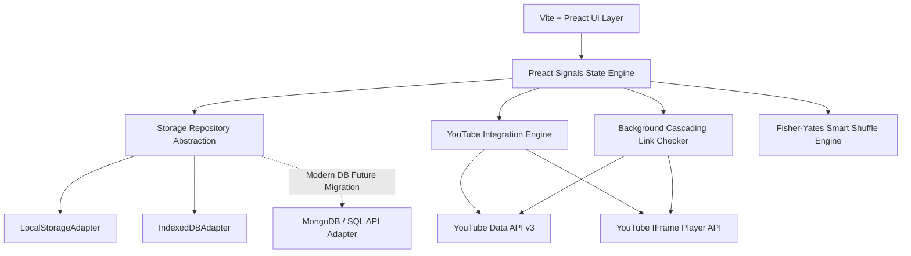

# 🎵 Plan de Arquitectura y Desarrollo: YouTube Playlist Player (Local-First)

Este plan documenta la visión técnica, la estructura modular y las etapas de desarrollo para crear un **Reproductor de Playlists de YouTube/YouTube Music local**, con soporte para metadatos editables (nombre de canción, artista), verificación continua de links rotos/deshabilitados, algoritmo de aleatorio inteligente (smart shuffle) y filtrado en tiempo real sin cortar la reproducción.

---

## 🎯 Objetivos Principales
1. **Persistencia Local y Modularidad**: Base de datos local inicial (LocalStorage / IndexedDB) mediante el patrón **Storage Adapter / Repository**, permitiendo migrar a futuro a MongoDB, PostgreSQL o API Backend sin tocar la interfaz ni la lógica de negocio.
2. **Edición de Metadatos**: Extracción automática de `Artista` y `Título de Canción` a partir del título de YouTube, permitiendo al usuario corregir/editar manualmente estos datos para búsquedas y ordenamiento más limpios.
3. **Verificador en Cascadas de Links Rotos**: Sistema que revisa en segundo plano (al iniciar la app y en cascada durante la sesión) el estado de cada video (eliminado, privado, restringido por región o embed deshabilitado), alertando con insignias visuales y facilitando la actualización/reemplazo del link.
4. **Reproducción Aleatoria (Smart Shuffle)**: Algoritmo de Shuffle verdadero (Fisher-Yates con cola sin repetición) que soluciona el aleatorio limitado de YouTube.
5. **Búsqueda y Filtrado Activo**: Filtrado por Nombre de Canción o Artista, ajustando la cola de reproducción actual sin detener la canción sonando.
6. **Mínimas Dependencias Externas**: Construido sobre Vite, Preact, `@preact/signals` y Tailwind CSS.

---

## 🏗️ Arquitectura del Sistema



---

## 📁 Estructura de Directorios Propuesta

```
youtube-player/
├── AGENTS.md                  # Manual de desarrollo y guías multi-sesión
├── package.json
├── index.html
├── vite.config.js
├── tailwind.config.js
└── src/
    ├── main.jsx               # Punto de entrada Preact
    ├── index.css              # Estilos globales y micro-animaciones CSS
    ├── storage/               # Capa Abstraída de Persistencia
    │   ├── StorageAdapter.js  # Interfaz / Clase base abstracta
    │   ├── LocalStorageAdapter.js
    │   ├── IndexedDBAdapter.js
    │   └── index.js           # Exportador de adaptador activo
    ├── api/                   # Servicios Externos y Parsers
    │   ├── youtubeApi.js      # Fetcher de playlists y estado de videos via API key
    │   ├── iframePlayer.js    # Control e integración con el reproductor embebido
    │   ├── metadataParser.js  # Heurística para separar "Artista - Canción"
    │   └── linkChecker.js     # Verificador en cascada de links
    ├── state/                 # Manejo de Estado con Preact Signals
    │   ├── playlistState.js   # Estado de listas y canciones
    │   ├── playerState.js     # Reproductor actual, cola, shuffle, volumen
    │   └── settingsState.js   # API Key y configuraciones de almacenamiento
    ├── components/            # Componentes React/Preact
    │   ├── layout/            # Navbar, Sidebar, Marco principal
    │   ├── player/            # Barra inferior del reproductor, seekbar, volumen
    │   ├── playlist/          # Tabla de canciones, modal de edición, badges de estado
    │   ├── queue/             # Vista de Siguientes Canciones (Queue)
    │   └── settings/          # Modal de configuración (API Key / Exportar DB)
    └── utils/                 # Algoritmos auxiliares (Shuffle, Filtros)
        └── helpers.js
```

---

## 🗓️ Roadmap de Desarrollo por Fases

| Fase | Título | Descripción y Entregables |
| :--- | :--- | :--- |
| **Fase 1** | **Setup & Capa de Persistencia** | Configurar Vite + Preact + Tailwind CSS. Implementar la interfaz `StorageAdapter` con `IndexedDBAdapter` y `LocalStorageAdapter`. Crear archivo `AGENTS.md`. |
| **Fase 2** | **Integración de YouTube & Player Core** | Integrar `YouTube Data API v3` y `IFrame Player API`. Crear la barra inferior del reproductor (play/pause, seek, volumen, miniatura). |
| **Fase 3** | **Gestión de Lista & Parser de Metadatos** | Crear vista de playlist, tabla de canciones. Desarrollar `metadataParser.js` para auto-separar Artista/Canción y modal de edición manual. |
| **Fase 4** | **Smart Shuffle & Filtrado en Tiempo Real** | Algoritmo Fisher-Yates con control de historia. Motor de filtrado por nombre/artista que actualiza la cola activa dinámicamente. |
| **Fase 5** | **Verificador de Links en Cascadas (Link Health)** | Worker/Checker en segundo plano para detectar videos borrados/privados. Badges visuales de estado y modal para actualizar/reemplazar links rotos. |
| **Fase 6** | **Exportación/Importación & Pulido Visual** | Exportar/importar backup JSON de la DB. Teclas de acceso rápido (espacio, flechas, 'M'), micro-animaciones y diseño glassmorphism. |

---

## 📌 Instrucciones para Continuar en Próximas Sesiones
Todas las especificaciones detalladas del proyecto, estructuras de datos (`Track`, `Playlist`), interfaces de almacenamiento y guías paso a paso han quedado registradas en el archivo [`AGENTS.md`](file:///D:/youtube-player/AGENTS.md). 

Para comenzar a construir la Fase 1 en la siguiente sesión, solo se requerirá inicializar las dependencias e implementar los adaptadores de almacenamiento base.
